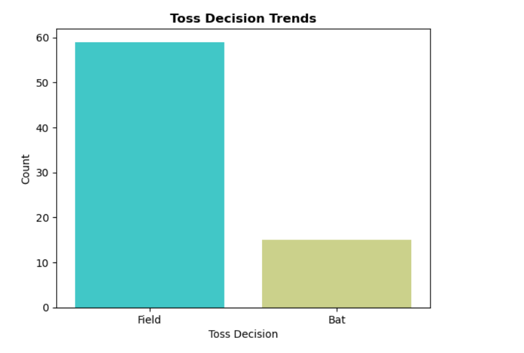
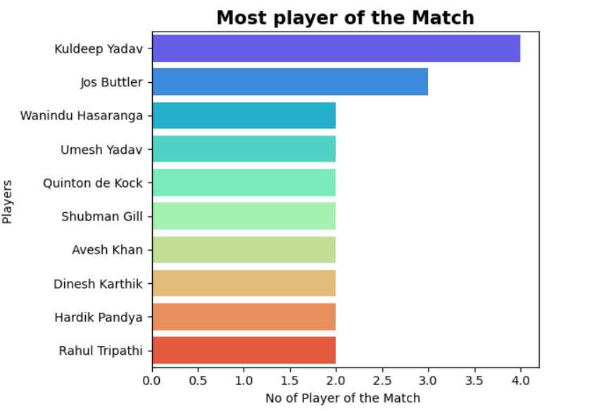
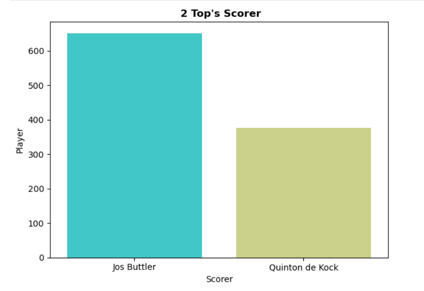
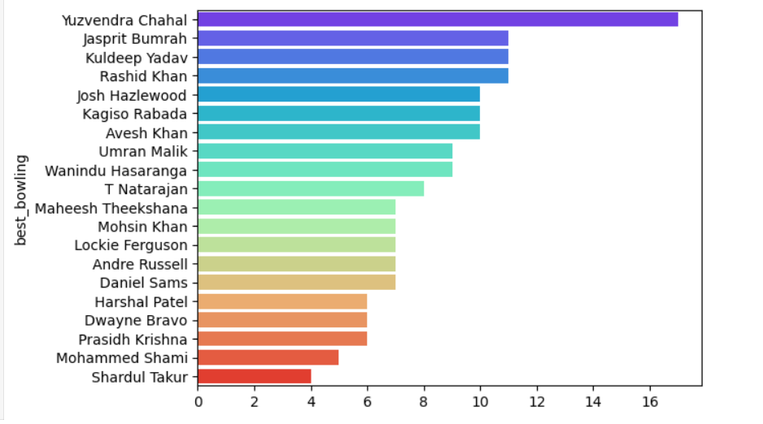

# 🏏 IPL Data Visualization Project

## 📊 Overview
This project analyzes and visualizes **Indian Premier League (IPL)** cricket data to uncover key insights about matches, teams, and players.  
The visualizations are created using Python libraries such as **Pandas**, **Matplotlib**, and **Seaborn** within a Jupyter Notebook.

---

## 🎯 Objectives
- Explore IPL datasets to identify trends and patterns  
- Visualize match outcomes, team performance, and player statistics  
- Gain insights such as:
  - Most successful teams  
  - Toss decisions vs match results  
  - Player performance distributions  
  - Venue-based winning trends  

---

## 🧠 Dataset Information
**File:** `IPL.csv`  
**Description:** Contains historical IPL match data, including:
- `id` – Unique match ID  
- `season` – Year of the match  
- `city` – Match venue  
- `team1`, `team2` – Competing teams  
- `toss_winner`, `toss_decision` – Toss information  
- `winner` – Match-winning team  
- `player_of_match` – Best performer in the match  
- `venue` – Ground where the match was played  

---

## 🧰 Tools & Libraries Used
- **Python 3.13.0**  
- **Jupyter Notebook**  
- **Pandas** – Data cleaning and analysis  
- **NumPy** – Numerical computations  
- **Matplotlib** – Basic plotting  
- **Seaborn** – Advanced data visualization  

---

## 📂 Project Structure
```
📦 IPL-Data-Visualization
 ┣ 📜 ipl projects.ipynb
 ┣ 📜 IPL.csv
 ┣ 📜 README.md
 ┗ 📂 visuals
    ┣ 📜 most_player_off_the_match.png
    ┣ 📜 best_bowler.png
    ┣ 📜 top_Scorer.png
    ┗ 📜 toss_analysis.png
    ┗ 📜 team_wins.png
```

---

## ⚙️ How to Run
1. Clone this repository:
   ```bash
   git clone https://github.com/mmiskatul/IPL-Data-Visualization.git
   cd IPL-Data-Visualization
   ```

2. Install dependencies:
   ```bash
   pip install pandas numpy matplotlib seaborn
   ```

3. Launch the Jupyter Notebook:
   ```bash
   jupyter notebook
   ```

4. Open and run all cells in `ipl projects.ipynb`

---

## 📈 Example Visualizations
| Visualization | Description |
|----------------|-------------|
|  | Number of matches won by each IPL team |
|  |Toss decision |
|  |Players with the most “Player of the Match” awards|
|  |Players with Top's Scorer Off the Tournament |
|  | Players with the most "Best Bowler of the Tournament”  |

---

## 🔍 Insights
- Certain venues favor teams batting first more often.  
- Toss decisions have a measurable (but not dominant) impact on outcomes.  
- A few key players consistently influence their team’s performance.

---

## 🧑‍💻 Author
**Md. Miskatul Masabi**  
🎓 Daffodil International University  
📧 masabimiskat@gmail.com  
🌐 GitHub: [miskatulmasabi](https://github.com/mmiskatul)

---

## 📝 License
This project is open-source and available under the **MIT License**.
